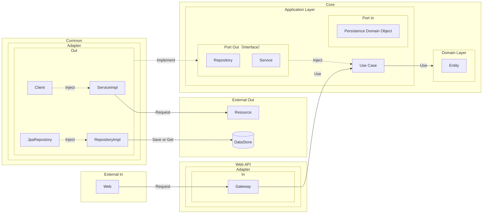

# 📋 Overview
This repository demonstrates a Clean Architecture implementation using Quarkus with Kotlin.

# ✨ Features

- 🏗️ **Clean Architecture** - Clear separation of concerns with domain-driven design
- 🔷 **Hexagonal Architecture** - Ports and Adapters pattern for flexibility
- ⚡ **Quarkus** - Supersonic Subatomic Java framework with native compilation support
- 🎯 **Kotlin** - Modern, expressive, and type-safe programming language
- 📦 **Multi-Module Structure** - Organized codebase with clear boundaries
- 🔐 **Keycloak Ready** - Built-in authentication and authorization support
- 🧪 **Testing Ready** - Structure optimized for unit and integration tests
- 🐳 **Docker Support** - Containerization ready with .dockerignore
- 🚀 **Production Ready** - Battle-tested patterns and best practices

# 🚀 Quick Start

### Prerequisites

- Java 17 or later
- Gradle 8.0+
- Docker (optional, for containerization)

### 1. Use This Template

Click the **"Use this template"** button on GitHub or clone directly:

```bash
git clone https://github.com/axuanhogan/quarkus-kotlin-clean-arch-template.git
cd quarkus-kotlin-clean-arch-template
```

### 2. Run in Development Mode

```bash
./gradlew quarkusDev
```

The application will start at `http://localhost:8080`

### 3. Build for Production

```bash
# JVM mode
./gradlew build

# Native mode (requires GraalVM)
./gradlew build -Dquarkus.package.type=native
```

# 🐳 Docker

### Build Docker Image

```bash
# Build JVM image
docker build -f src/main/docker/Dockerfile.jvm -t quarkus-app:jvm .

# Build Native image
docker build -f src/main/docker/Dockerfile.native -t quarkus-app:native .
```

# 📖 Usage Guide

### Update Package Names

1. Rename packages to match your project domain
2. Update `settings.gradle.kts` if you rename modules
3. Update imports across the project

### Add Dependencies

Edit `build.gradle.kts` to add new dependencies:

```kotlin
dependencies {
    // Add your dependencies here
    implementation("io.quarkus:quarkus-hibernate-validator")
}
```

### Configure Application

Edit `application*.yml` in `web-api/src/main/resources/`:

```properties
# Application name
quarkus.application.name=your-app-name

# Database configuration
quarkus.datasource.db-kind=postgresql
quarkus.datasource.username=your-username
quarkus.datasource.password=your-password
```

### Run Container

```bash
docker run -i --rm -p 8080:8080 quarkus-app:jvm
```

# 🏛️ Architecture

This template follows **Clean Architecture** principles combined with **Hexagonal Architecture** (Ports and Adapters) pattern.

### Diagram



### Module Dependencies

```
web-api  →  core  ←  common
   ↓                    ↑
   └────────────────────┘
```

- **core**: No external dependencies (pure business logic)
- **common**: Depends on core (implements ports)
- **web-api**: Depends on core (uses use cases)

# 💡 Tips

- Start with simple features and gradually add complexity
- Keep the `core` module free from framework dependencies
- Use value objects for domain primitives (e.g., `Email`, `UserId`)
- Follow the dependency rule: dependencies point inward

# 📚 Resources

### Clean Architecture
- [The Clean Architecture (Uncle Bob)](https://blog.cleancoder.com/uncle-bob/2012/08/13/the-clean-architecture.html)

### Hexagonal Architecture
- [Hexagonal Architecture (Alistair Cockburn)](https://alistair.cockburn.us/hexagonal-architecture/)
- [Ports and Adapters Pattern](https://herbertograca.com/2017/09/14/ports-adapters-architecture/)

### Quarkus
- [Quarkus Official Documentation](https://quarkus.io/guides/)
- [Quarkus with Kotlin](https://quarkus.io/guides/kotlin)

### Kotlin
- [Kotlin Official Documentation](https://kotlinlang.org/docs/home.html)
- [Kotlin for Backend Development](https://kotlinlang.org/docs/server-overview.html)

